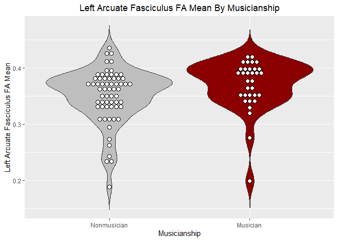

probtrackx\_scalars\_analysis
================

``` r
# Load data in RStudio
library(readxl)
data <- read_excel("C:/Users/yaenc/OneDrive - Northeastern University/THIRD YEAR/PROFESSIONAL/MIND Lab/FitKids/SPSSwithFA/Final_SPSSwithFAdata.xlsx")
# Load libraries of interest
library(ggplot2)
library(Hmisc)
```

``` r
musicians_subset <- data[ which(data$pre_play_an_instrument=='1'),]
nonmusicians_subset <- data[ which(data$pre_play_an_instrument=='0'),]
library(plyr)
count(nonmusicians_subset$leftPCG_leftSTGp_FA_Mean)
```

    ##           x freq
    ## 1  0.188282    1
    ## 2  0.233271    1
    ## 3  0.233507    1
    ## 4  0.242952    1
    ## 5  0.262360    1
    ## 6  0.272990    1
    ## 7  0.293939    1
    ## 8  0.305780    1
    ## 9  0.305852    1
    ## 10 0.307081    1
    ## 11 0.309523    1
    ## 12 0.311545    1
    ## 13 0.327145    1
    ## 14 0.330296    1
    ## 15 0.330491    1
    ## 16 0.332131    1
    ## 17 0.332914    1
    ## 18 0.334067    1
    ## 19 0.335988    1
    ## 20 0.336172    1
    ## 21 0.336571    1
    ## 22 0.338600    1
    ## 23 0.340797    1
    ## 24 0.342383    1
    ## 25 0.346716    1
    ## 26 0.347464    1
    ## 27 0.351777    1
    ## 28 0.352288    1
    ## 29 0.358632    1
    ## 30 0.360581    1
    ## 31 0.363350    1
    ## 32 0.365398    1
    ## 33 0.366435    1
    ## 34 0.368420    1
    ## 35 0.368895    1
    ## 36 0.369108    1
    ## 37 0.369546    1
    ## 38 0.370940    1
    ## 39 0.371526    1
    ## 40 0.371646    1
    ## 41 0.372128    1
    ## 42 0.374206    1
    ## 43 0.374339    1
    ## 44 0.376692    1
    ## 45 0.376914    1
    ## 46 0.377216    1
    ## 47 0.377696    1
    ## 48 0.378670    1
    ## 49 0.379323    1
    ## 50 0.384563    1
    ## 51 0.384973    1
    ## 52 0.386119    1
    ## 53 0.386944    1
    ## 54 0.388483    1
    ## 55 0.391223    1
    ## 56 0.392248    1
    ## 57 0.393222    1
    ## 58 0.397193    1
    ## 59 0.410597    1
    ## 60 0.411843    1
    ## 61 0.421753    1
    ## 62 0.429765    1
    ## 63 0.435219    1
    ## 64       NA   63

``` r
count(musicians_subset$leftPCG_leftSTGp_FA_Mean)
```

    ##           x freq
    ## 1  0.198709    1
    ## 2  0.275892    1
    ## 3  0.319813    1
    ## 4  0.328807    1
    ## 5  0.339789    1
    ## 6  0.340016    1
    ## 7  0.341906    1
    ## 8  0.349548    1
    ## 9  0.349986    1
    ## 10 0.351443    1
    ## 11 0.353233    1
    ## 12 0.354022    1
    ## 13 0.361919    1
    ## 14 0.366550    1
    ## 15 0.373291    1
    ## 16 0.380366    1
    ## 17 0.386807    1
    ## 18 0.390384    1
    ## 19 0.390843    1
    ## 20 0.392323    1
    ## 21 0.394818    1
    ## 22 0.394987    1
    ## 23 0.395504    1
    ## 24 0.396479    1
    ## 25 0.396957    1
    ## 26 0.397089    1
    ## 27 0.400829    1
    ## 28 0.409019    1
    ## 29 0.410681    1
    ## 30 0.410798    1
    ## 31 0.412848    1
    ## 32 0.418747    1
    ## 33 0.420592    1
    ## 34       NA   16

``` r
# Make violin plot of left AF Mean by musicianship
p <- ggplot(data, aes(x=factor(pre_play_an_instrument), y=leftPCG_leftSTGp_FA_Mean, fill=factor(pre_play_an_instrument))) + geom_violin(trim=FALSE) +ggtitle("Left Arcuate Fasciculus FA Mean By Musicianship") + xlab("Musicianship") + ylab("Left Arcuate Fasciculus FA Mean") + scale_x_discrete(labels=c('Nonmusician', 'Musician'))

# Add dot distribution
p + geom_dotplot(binaxis='y', stackdir='center', dotsize=1, fill='white') + scale_fill_manual(values=c("gray", "darkred"))  + theme(legend.position = "none", plot.title = element_text(hjust = 0.5)) 
```

<!-- -->
